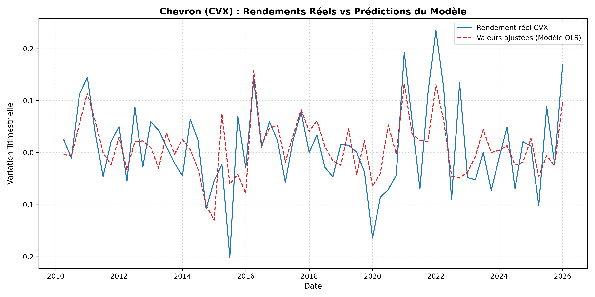

# Analyse Économétrique : Modélisation de l'action Chevron (CVX) avec Python

> Étude empirique analysant l'impact de facteurs macroéconomiques et financiers sur les rendements trimestriels de l'action Chevron Corporation (CVX) à l'aide de Pandas et Statsmodels.

---

## 1. Présentation du projet

Ce projet a pour objectif d'analyser ce qui influence le cours de bourse de la compagnie pétrolière **Chevron ($CVX$)**. 

En tant que major de l'énergie, les performances de Chevron dépendent de variables clés :
* **Pétrole Brent ($Oil$)** : Prix du brut, moteur direct des revenus pétroliers.
* **S&P 500 ($SP500$)** : Tendance globale de la bourse américaine (risque de marché).
* **Or ($Gold$)** : Valeur refuge contre les crises et la dépréciation monétaire.
* **Écart de taux 10 ans - 2 ans ($UST10$)** : Indicateur de politique monétaire et de cycle économique.
* **Indice VIX ($VIX$)** : Mesure de la volatilité et de l'aversion au risque.
* **PIB ($PIB$)** : Croissance économique globale des États-Unis.
* **Indice des prix ($CPI$)** : Inflation américaine utilisée pour ajuster les prix en termes réels.

---

## 2. Préparation des données (Pandas)

1. **Synchronisation des séries** : Fusion des historiques quotidiens par jointure interne (`join='inner'`) pour ne conserver que les dates communes à tous les marchés.
2. **Traitement des valeurs manquantes** : Remplissage des données manquantes (notamment sur l'inflation) par interpolation linéaire (`.interpolate()`).
3. **Agrégation trimestrielle** : Conversion à la fréquence de début de trimestre (`QS` - Quarter Start) avec `.resample('QS').mean()` pour s'aligner sur la périodicité du PIB.
4. **Déflation par l'inflation** : Division des séries nominales ($CVX$, $Gold$, $Oil$, $SP500$, $PIB$) par le $CPI$ pour analyser l'évolution en pouvoir d'achat constant.
5. **Stationnarité et rendements** : Transformation des variables de prix en taux de variation trimestriels (`.pct_change()`).

---

## 3. Démarche et tests statistiques (Statsmodels)

* **Test de stationnarité (ADF)** : Test de Dickey-Fuller augmenté pour vérifier l'absence de tendance déterministe ou stochastique sur les rendements.
* **Test de saisonnalité** : Régression sur variables muettes trimestrielles ($Q_2, Q_3, Q_4$) pour vérifier l'absence de biais saisonnier.
* **Régression linéaire multiple (OLS)** : Estimation de la relation entre les variations des facteurs et le rendement de $CVX$.
* **Multicolinéarité (VIF)** : Calcul du Facteur d'Inflation de la Variance pour vérifier l'indépendance des variables explicatives.
* **Autocorrélation (Breusch-Godfrey)** : Test sur 4 retards pour vérifier que les résidus ne sont pas sériellement corrélés.
* **Hétéroscédasticité et correction HC3** : Tests de Breusch-Pagan et White. Face à la variance non constante des erreurs, le modèle est estimé avec des erreurs standards robustes (`cov_type='HC3'`).
* **Effet ARCH** : Test d'Engle pour évaluer la présence de grappes de volatilité.

---

## 4. Installation et exécution

### Prérequis
* Python 3.9 ou supérieur

### 1. Cloner le projet
```bash
git clone [https://github.com/](https://github.com/)<ton-pseudo>/cvx-analyse-econometrique.git
cd cvx-analyse-econometrique

## 5. Visualisation des résultats


